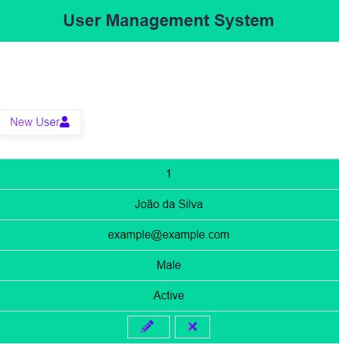

<h1 align="center">user_Management</h1> 

<h2 align="center">A CRUD operation with nodeJS, MongoDB and Express.</h2>
 
<h2>How to run the Project</h2>
 
    - Clone the project

 
    - Install the NodeJS modules using: <b>npm install</b> 

 
    - Set the config.env 'MONGO_URI' variable with your database value

 
    - Run command: <b>npm start</b>

  

<h3 align="center">- Show all users in DB -</h3>

  

  
<h3 align="center">- Responsive Layout -</h3>

  

  
<h3 align="center">- Add user Layout -</h3>

  

